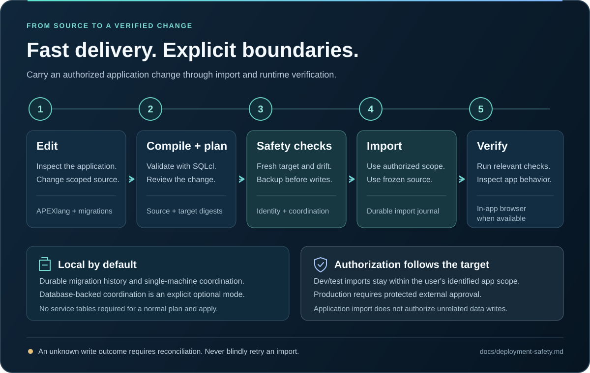

# APEXREST for Codex

English | [Українська](README.uk.md)


[](https://github.com/apexrest-dev/apexrest-codex/actions/workflows/ci.yml)

**Build and change Oracle APEX applications with Codex, from source to a verified import.**

New to Oracle APEX? It is a platform for building business web applications—forms, dashboards, reports and internal tools—on top of Oracle Database. APEXREST connects that workflow to Codex, OpenAI's coding agent: a request such as “add an order status report” becomes application source changes, checks and a controlled deployment process.

APEXREST connects native Codex skills and MCP tools to Oracle SQLcl. Generate APEXlang, adopt an existing app, edit pages and shared components, plan the change, import it into an authorized target, and check the result in the Codex in-app browser.

[Get started](docs/getting-started.md) · [Documentation](docs/index.md) · [Deployment safety](docs/deployment-safety.md) · [Verification status](docs/implementation-status.md) · [Contributing](CONTRIBUTING.md)


> **Beta: `0.4.0-beta.1`.** Single mode uses your current Codex session; teams require explicit Settings opt-in. Programmatic job waiting, metadata batches, concise project summaries and focused reference retrieval reduce repeated model/tool exchanges; see the [release notes](docs/release-notes.md). Existing Oracle template compilation, unchanged ORDS application round-trip and native Codex installation evidence retains its recorded scope and version. Stable release readiness is still blocked by the remaining integration, recovery and platform checks. Independent APEXREST tooling; not an official Oracle or OpenAI product.

Describe the implementation in Codex chat: `$apexrest-work` uses the existing session directly in single mode, without another agent or automatic panel startup. The current host controls its model and permissions. Explicitly enabled teams retain separate sessions, Auto model routing and the in-app panel; results return to the same conversation. See [chat workflow and Auto models](docs/chat-workflow.md). The team retains separate developers, mandatory manager code review, independent QA and final manager review. See [team APIs and review gates](docs/team.md) and the [Codex source audit](docs/codex-integration.md).

Single agent is the default; teams require explicit opt-in in Settings. See [execution settings](docs/work-modes.md).

Settings offer **Single agent / Agent team** and **Codex in-app browser / External system browser** for APEX verification. Single mode works in the current chat; the dashboard remains available on request. [Settings and verification boundaries](docs/work-modes.md).

**Settings → Database network transport** selects **Direct Oracle listener** or **ORDS HTTP(S)** for new operations across projects. Direct mode offers a picker of your saved SQLcl connections. ORDS uses your existing database username and password with the schema's ORDS URL when the listener, commonly on port 1521, is unavailable. Its connection settings and password stay in private plugin-level local files; enter the password in the local dashboard or through CLI `--password-file`. ORDS uses SQLcl CLI and supports the APEXlang import/export workflow. Switching back preserves both connection mappings. See [SQL through ORDS](docs/ords.md) for setup and verification limits.

Open `$apexrest-panel` for live project settings, Pokémon agent activity, mandatory reviews, QA and APEX operations inside Codex. The console view is `apexrest panel tui`. See the [development panel](docs/panel.md).

Read the [complete agent workflow with screenshots](docs/agent-workflow.md): task setup, Pokémon roles, mandatory reviews, QA, repair cycles and authorized APEX delivery.


_Actual Codex in-app browser capture. This isolated coding example verifies team execution; it does not represent an Oracle import._

## ORDS SQL: a path to Codex Cloud

APEXREST supports SQL through **Oracle REST Data Services (ORDS)**. ORDS lets the tools communicate with your database over HTTPS, without a direct connection to the Oracle database listener. This enables a Cloud setup using APEXREST's bundled command-line tools inside the Codex Cloud container. Your database stays where it is.

For example, in SQLcl—Oracle's command-line tool:

```sql
connect -orest app_user@https://example.com/ords/app_user/
```

The `-orest` option selects the REST connection. Replace the example account and schema URL with your authorized target; REST-Enabled SQL must be enabled. The account still needs database credentials and the permissions required for the requested work. See [SQL through ORDS](docs/ords.md).

| | Local mode | Codex Cloud setup |
| --- | --- | --- |
| Where tasks run | On your computer; it must stay on while agents work. | In a hosted container; your home computer can be off. |
| Tools and dependencies | Installed and maintained on your computer. | Prepared through reusable setup and maintenance scripts. |
| Database access | Direct Oracle connection or ORDS HTTP(S). | The documented setup uses an authorized ORDS endpoint over HTTPS. |

### Delegate from your phone

After configuring [Codex's native Slack integration](https://learn.chatgpt.com/docs/third-party/slack), you can send a request with `@Codex` and follow its Cloud task. Slack's [mobile messaging](https://slack.com/help/articles/201457107-Send-and-read-messages) makes this a way to delegate from your phone. Cloud execution frees your laptop for other work and does not depend on a computer running at home.

The **ChatGPT mobile app's [Remote mode](https://learn.chatgpt.com/docs/remote)** connects to a computer that must remain awake and online. It has a different execution requirement from a Cloud task.

### An agent-team workflow to configure and verify

With the Cloud environment, database access and applicable tests configured, the intended workflow is:

1. A developer agent prepares the APEX application changes.
2. A reviewer checks the code.
3. An independent QA agent runs the configured tests.
4. You review the result before an authorized deployment.

The [Cloud setup guide](docs/codex-cloud.md) covers **CLI + ORDS**. The complete agent-team workflow in Codex Cloud still needs end-to-end verification; the guide does not establish native Cloud plugin/MCP discovery or panel support. Existing local team and Oracle evidence retains its documented scope.


_Illustrative overview, with the setup and verification limits described above._

## Install from npm

Use Node 24 LTS (supported range: Node 24–26). The public [apexrest package](https://www.npmjs.com/package/apexrest) is currently `0.4.0-beta.1`; `latest` and `beta` both select this beta version.

Install the CLI globally and check its version:

```sh
npm install -g apexrest
apexrest --version
apexrest
```

The last command opens the terminal menu. Choose **Install tools** for missing dependencies, then **Install plugin** to register APEXREST in Codex. npm installs the CLI and bundled resources; plugin registration is a separate menu action.

For a project-local installation:

```sh
npm install apexrest
npx apexrest --version
npx apexrest
```

To pin this release, use `npm install -g apexrest@0.4.0-beta.1`. The repository installation below remains available.

## Install with the terminal menu

With Git and Node 24 LTS available, open the bundled TUI from the repository. **Install plugin** also requires a Codex CLI with native plugin support.

```sh
git clone https://github.com/apexrest-dev/apexrest-codex.git
cd apexrest-codex
node plugins/apexrest-apex/runtime/apexrest.mjs
```

1. Choose **Install tools** for Node.js, Java, SQLcl and browser tools. Read the Oracle terms and enable **Accept Oracle license terms** if you agree. **Skip browser installation** omits browser tools.
2. Choose **Install plugin** to register APEXREST in Codex using the existing runtime.
3. Restart Codex and start a new task. Add the managed `bin` directory to PATH using the [launcher instructions](docs/getting-started.md#use-the-cli) so `apexrest` opens the menu from any folder.

On **Review**, press Enter to execute the selected action. There are no **Preview only** or **Approve changes** toggles. The bundled package needs no `npm ci` or TypeScript build. The full [installation guide](docs/getting-started.md#install-with-the-terminal-menu) also covers connection checks and removal.

## Install in Codex

For direct plugin registration through the Codex CLI, keep Node 24 LTS on `PATH` and run:

```sh
codex plugin marketplace add apexrest-dev/apexrest-codex
codex plugin add apexrest-apex@apexrest
```

The repository includes the bundled runtime; no `npm ci` or local build is needed for this installation. Start a new Codex task after registration. The [installation guide](docs/getting-started.md#install-the-plugin) covers verification, Oracle runtime setup, managed installation and removal. Installation does not create a database or deploy an application.

After installation, start a new Codex task and ask:

> Use APEXREST to check my setup. Report the compiler, connection and target checks that still need attention.

You need a Codex host with native plugin support. Oracle work also needs the reviewed Node, Java and SQLcl runtimes, an existing supported APEX target, and either a saved direct SQLcl connection or plugin-local ORDS connection credentials. The [quickstart](docs/getting-started.md) explains each step; never paste passwords into a prompt.

Send `Use $apexrest-menu` in the Codex message box to show **All functions** in the conversation: setup, projects, APEX, database, deployment, testing, diagnostics and review. This is a skill that displays a conversational menu; the plugin does not add a permanent APEXREST sidebar or top-menu button. See [how to find the menu](docs/getting-started.md#all-functions-in-the-codex-plugin-menu) for picker and plugin-page navigation.

To install Java, SQLcl and the other client tools, choose **Install dependencies** in the plugin menu or invoke `$apexrest-install-dependencies`. It offers all dependencies, Oracle tools without a browser, or a preview. See the [dependency command](docs/getting-started.md#install-dependencies-from-the-plugin-menu) for options and license consent.

## Terminal interface

**Install plugin** creates the managed launcher; direct registration with `codex plugin add` alone does not put `apexrest` on PATH. Saved connections come directly from the SQLcl store; listing and testing them requires no APEXREST alias.

Run `apexrest` in an interactive terminal for the APEXREST logo and seven direct actions: install/uninstall tools, install/uninstall the plugin, and list/test saved SQLcl connections. Use arrow keys or type to search. In the connection picker, Enter tests the selected name and Ctrl+R refreshes. Other workflows remain explicit CLI commands. Explicit commands and `--json` retain their scripting behavior; piped input prints help.

**SQLcl mode: CLI / MCP** saves the Oracle execution backend: SQLcl CLI or the official SQLcl MCP server (`sql -mcp`). This separate TUI action does not change plugin registration. See [SQLcl modes](docs/tui.md#sqlcl-mode-cli-or-mcp).

The home screen also includes an APEXlang table: 99 types in 9 groups from the bundled Oracle reference, including 23 page items. Tab switches between actions and the catalogue; type a name or group to search and use arrows to browse. The catalogue works locally without a database connection.

The [terminal guide](docs/tui.md) covers keyboard controls and launchers. From a source checkout, `node plugins/apexrest-apex/runtime/apexrest.mjs` opens the same interface. Native Codex plugin registration alone does not put `apexrest` on your shell’s `PATH`.

## What you can build

| Workflow                       | What APEXREST does                                                                                                        |
| ------------------------------ | ------------------------------------------------------------------------------------------------------------------------- |
| Create an application          | Generate real Oracle APEXlang and start from a blank app or the customer CRM template.                                    |
| Change an existing application | Export into a new directory, preserve Oracle IDs and `.apex` metadata, and edit the source under version control.         |
| Build a dashboard              | Use real source queries, native APEX components, submitted filter items and runtime checks.                               |
| Deploy a change                | Bind an immutable plan to source, toolchain and target; back up an existing app; import under the required authorization. |
| Test and diagnose              | Run configured unit, SQL, API or browser suites; inspect bounded diagnostics and background-job results.                  |

An explicit request to create, update or import an identified development/test app includes the necessary scoped import. Codex records that existing authorization and completes the workflow. Production uses a separate, externally signed approval on a protected runner.

## Start with a concrete request

**Create an app**

> Use APEXREST to create a customer CRM in the configured development environment. Include customer search, a validated edit form and a dashboard. Complete the plan, authorized import and relevant runtime checks.

**Change an existing app**

> Use APEXREST to adopt application 100 from the configured test environment into a new project. Add a sales dashboard using real database measures. Preserve the existing pages, shared components and authentication, then import and verify the change.

**Make the next edit**

> Update the dashboard filters to refresh the affected native regions. Reuse the existing project and connection, reconcile the measures, import into the same test app and verify the interactions in the in-app browser.

Replace example IDs and environment names with your actual target. Codex asks for missing non-secret identity information; it does not guess a database or expand the request to unrelated schema writes.

## A short path from edit to import



The workflow reuses project discovery, batches related edits and avoids a redundant compiler run immediately before planning. Independent read-only preflight checks run concurrently. Every write still requires fresh target checks, source and target drift checks, coordination, and a verified backup for an existing application.

A clean supported APEX installation is sufficient. APEXREST service tables are **not required**: durable local migration history and coordination are the default. Independent machines need external serialization or the explicitly selected database coordination mode. [Understand the deployment boundary](docs/deployment-safety.md).

## What has been verified

| Area                | Available evidence                                                                                                              | Remaining scope                                                                            |
| ------------------- | ------------------------------------------------------------------------------------------------------------------------------- | ------------------------------------------------------------------------------------------ |
| Native Codex plugin | Isolated installation, discovery, tool calls and lifecycle on Codex 0.154.0 / macOS arm64                                       | Other host and platform combinations; evidence must be refreshed for a stable release      |
| Oracle APEXlang     | Real blank/CRM compilation with local SQLcl, without a database connection                                                      | Changed imports, broader component coverage and unsupported-component fixtures             |
| ORDS connectivity   | [Authorized unchanged export/import/export](docs/evidence/ords-connected.json), SQL backup creation and 21 byte-identical files | Changed imports, SQL restore, interrupted-response recovery and application browser checks |
| Local runtime       | Unit, CLI/MCP contract, installer and packaging checks with explicitly labelled fixtures                                        | Connected recovery, fault-injection, SQL/CRUD integration and application browser checks   |

Unit tests, mocked failure scenarios, real Oracle operations and native-host checks are recorded separately. See the [acceptance matrix](docs/acceptance.json), [implementation status](docs/implementation-status.md) and [remaining release gates](docs/next-actions.md). A missing or skipped integration suite is not a passing result.

## Develop locally

Use Node 24 LTS and the committed npm lockfile:

```sh
npm ci --ignore-scripts
npm run build
npm run lint
npm run typecheck
npm run test:unit
npm run test:contracts
npm run test:installers
npm run site:build
npm run test:packaging
```

After source or resource changes, run `npm run plugin:sync` to refresh the checked-in native bundle. `npm run plugin:check` compares it with a fresh build. `npm run test:repository-plugin` checks its native installation in an isolated Codex profile. Native-host and Oracle checks require their documented prerequisites. `npm run release:dry-run` creates local artifacts and a readiness report; `npm run check-release-readiness` fails while required evidence is missing. Neither command publishes a release. See [contributing](CONTRIBUTING.md) and [testing](docs/testing.md).

## Documentation and support

- [Getting started](docs/getting-started.md): install, connect, create or adopt, plan and verify.
- [Codex Cloud](docs/codex-cloud.md): container setup, CLI over ORDS, secrets, proxy and maintenance.
- [Configuration](docs/configuration.md): explicit targets, connection references and private policy.
- [SQL through ORDS](docs/ords.md): HTTP(S) transport, database credentials and APEXlang import/export.
- [Architecture](docs/architecture.md): one core behind the CLI, MCP and skills.
- [Troubleshooting](docs/troubleshooting.md): setup, compiler, auth and recovery diagnostics.
- [Security](SECURITY.md): credential boundaries, trusted code and private reports.
- [Publisher setup](docs/publishing.md): protected release workflow and outstanding prerequisites.

Report reproducible bugs through [GitHub issues](https://github.com/apexrest-dev/apexrest-codex/issues), with sanitized diagnostics. Follow [SECURITY.md](SECURITY.md) for sensitive reports. Licensed under [Apache-2.0](LICENSE).
