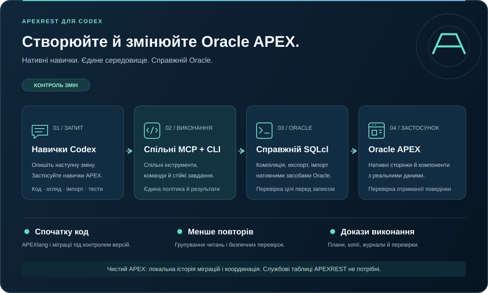
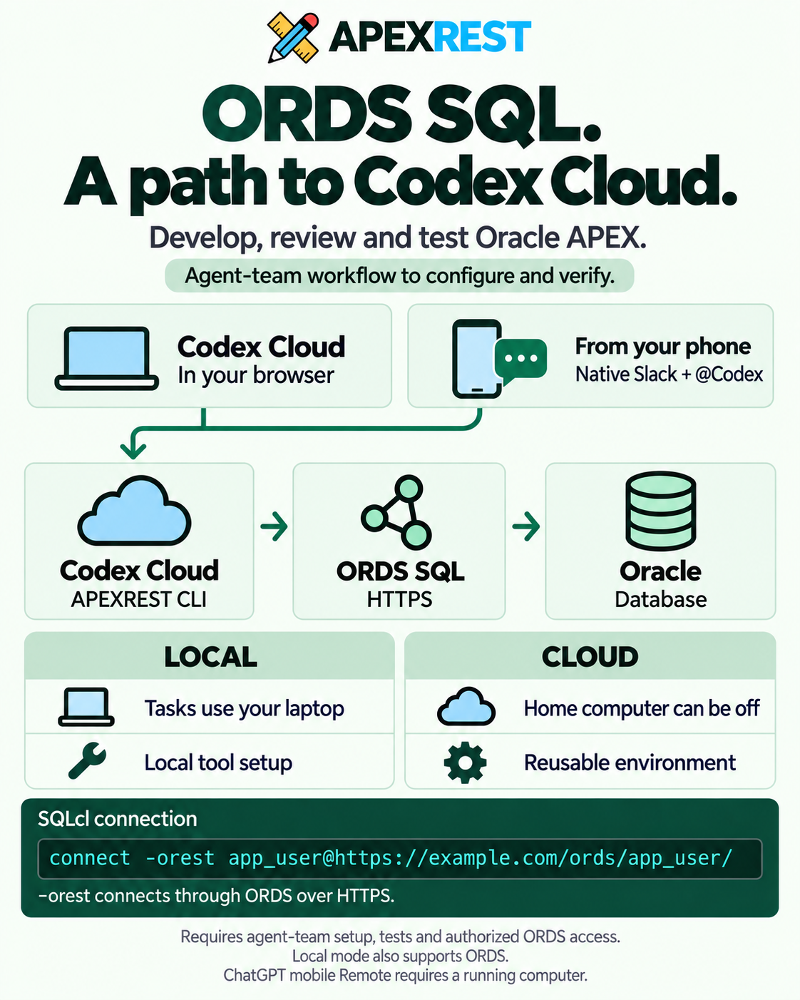
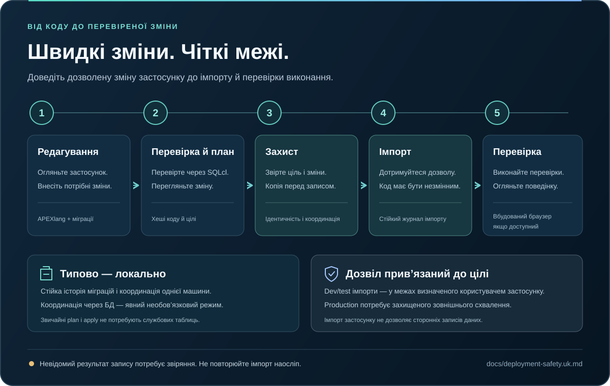

# APEXREST для Codex

[English](README.md) | Українська


[](https://github.com/apexrest-dev/apexrest-codex/actions/workflows/ci.yml)

**Створюйте й змінюйте застосунки Oracle APEX за допомогою Codex: від вихідного коду до перевіреного імпорту.**

Ще не знайомі з Oracle APEX? Це платформа для створення бізнес-вебзастосунків на основі Oracle Database: форм, дашбордів, звітів і внутрішніх інструментів. APEXREST поєднує цей процес із Codex, агентом OpenAI для роботи з кодом: запит на кшталт «додай звіт про статус замовлень» перетворюється на зміни коду застосунку, перевірки й контрольоване розгортання.

APEXREST поєднує нативні навички Codex та інструменти MCP з Oracle SQLcl. Генеруйте APEXlang, переносьте наявний застосунок у проєкт, редагуйте сторінки й спільні компоненти, плануйте зміни, імпортуйте їх у дозволену ціль і перевіряйте результат у вбудованому браузері Codex.

[Початок роботи](docs/getting-started.uk.md) · [Документація](docs/index.uk.md) · [Безпека розгортання](docs/deployment-safety.uk.md) · [Стан перевірки](docs/implementation-status.uk.md) · [Участь у розробці](CONTRIBUTING.uk.md)



> **Бета: `0.4.0-beta.1`.** Single використовує поточну сесію Codex; команда потребує явного увімкнення у Settings. Програмне очікування завдань, пакети метаданих, стислі відомості про проєкт і точковий пошук довідки зменшують повторні обміни між моделлю та інструментами; див. [примітки до випуску](docs/release-notes.uk.md). Наявні докази компіляції шаблонів Oracle, циклу незміненого застосунку через ORDS і нативного встановлення Codex зберігають зафіксовані межі та версії. Готовність стабільного випуску досі заблокована рештою інтеграційних, відновлювальних і платформних перевірок. APEXREST — незалежний інструмент, а не офіційний продукт Oracle чи OpenAI.

Опишіть реалізацію в чаті Codex: `$apexrest-work` у single використовує наявну сесію безпосередньо, без іншого агента чи автовідкриття панелі. Моделлю й дозволами керує поточний хост. Явно увімкнені команди зберігають окремі сесії, Auto-маршрутизацію моделей і вбудовану панель; результати повертаються в ту саму розмову. Дивіться [сценарій із чату та моделі Auto](docs/chat-workflow.uk.md). Команда зберігає окремих розробників, обов’язкове рев’ю коду менеджером, незалежний QA та фінальне рев’ю менеджером. Дивіться [API команди та умови схвалення](docs/team.uk.md) й [аудит коду Codex](docs/codex-integration.uk.md).

За замовчуванням працює один агент; команда потребує явного увімкнення у Settings. Дивіться [налаштування виконання](docs/work-modes.uk.md).

У Settings можна обрати **Single agent / Agent team** та **Codex in-app browser / External system browser** для перевірок APEX. Single працює в поточному чаті; панель доступна за запитом. [Налаштування й межі перевірки](docs/work-modes.uk.md).

**Settings → Database network transport** задає **Direct Oracle listener** або **ORDS HTTP(S)** для нових операцій у всіх проєктах. Прямий режим пропонує вибір збережених з’єднань SQLcl. ORDS використовує наявні ім’я користувача й пароль бази даних та ORDS URL схеми, коли listener, зазвичай на порту 1521, недоступний. Налаштування й пароль зберігаються у приватних локальних файлах плагіна; вводьте пароль у локальній панелі або через CLI `--password-file`. ORDS використовує SQLcl CLI та підтримує імпорт/експорт APEXlang. Перемикання назад зберігає обидва налаштування з’єднання. Посібник [SQL через ORDS](docs/ords.uk.md) описує налаштування й межі перевірки.

Відкрийте `$apexrest-panel`, щоб бачити налаштування проєкту, роботу агентів-покемонів, обов’язкові рев’ю, QA та операції APEX у Codex. Консольний режим — `apexrest panel tui`. Дивіться [панель розробки](docs/panel.uk.md).

Читайте [повний агентний процес зі скріншотами](docs/agent-workflow.uk.md): налаштування завдання, ролі покемонів, обов’язкові рев’ю, QA, цикли виправлень і дозволена доставка APEX.


_Справжній знімок вбудованого браузера Codex. Ізольований приклад із кодом перевіряє виконання команди; він не показує імпорт Oracle._

## ORDS SQL: шлях до Codex Cloud

APEXREST підтримує SQL через **Oracle REST Data Services (ORDS)**. ORDS дає інструментам доступ до бази через HTTPS без прямого з’єднання з Oracle listener. Це дозволяє налаштувати роботу комплектних інструментів командного рядка APEXREST у контейнері Codex Cloud. База даних залишається там, де вона розміщена.

Приклад у SQLcl — інструменті командного рядка Oracle:

```sql
connect -orest app_user@https://example.com/ords/app_user/
```

Параметр `-orest` обирає REST-з’єднання. Замініть приклади облікового запису й URL схеми на свою дозволену ціль; REST-Enabled SQL має бути ввімкнено. Обліковому запису все одно потрібні дані для входу до бази та права на запитану роботу. Дивіться [SQL через ORDS](docs/ords.uk.md).

| | Локальний режим | Налаштування Codex Cloud |
| --- | --- | --- |
| Де виконуються задачі | На вашому комп’ютері; він має залишатися ввімкненим, поки працюють агенти. | У хмарному контейнері; домашній комп’ютер може бути вимкнений. |
| Інструменти й залежності | Встановлюються й підтримуються на вашому комп’ютері. | Готуються скриптами налаштування й обслуговування для повторного використання. |
| Доступ до бази | Пряме з’єднання Oracle або ORDS HTTP(S). | Описане налаштування використовує дозволену точку доступу ORDS через HTTPS. |

### Делегуйте роботу з телефона

Після налаштування [нативної інтеграції Codex зі Slack](https://learn.chatgpt.com/docs/third-party/slack) можна надсилати запити з `@Codex` і стежити за їхніми задачами у Cloud. Завдяки [мобільним повідомленням Slack](https://slack.com/help/articles/201457107-Send-and-read-messages) це можна робити з телефона. Хмарне виконання звільняє ноутбук для іншої роботи й не залежить від увімкненого домашнього комп’ютера.

**[Режим Remote](https://learn.chatgpt.com/docs/remote) мобільного застосунку ChatGPT** підключається до комп’ютера, який має залишатися активним і в мережі. Його вимоги до виконання відрізняються від задачі у Cloud.

### Сценарій команди агентів, який ще потрібно налаштувати й перевірити

Після налаштування хмарного середовища, доступу до бази й відповідних тестів передбачено такий процес:

1. Агент-розробник готує зміни застосунку APEX.
2. Рецензент перевіряє код.
3. Незалежний QA-агент запускає налаштовані тести.
4. Ви переглядаєте результат перед дозволеним розгортанням.

[Посібник налаштування Cloud](docs/codex-cloud.uk.md) описує **CLI + ORDS**. Повний процес роботи команди агентів у Codex Cloud ще потребує наскрізної перевірки; посібник не підтверджує виявлення нативного плагіна/MCP або підтримку панелі у Cloud. Наявні докази локальної команди й Oracle зберігають свої задокументовані межі.



_Ілюстративний огляд англійською; налаштування й межі перевірки пояснено українською вище._

## Встановлення з npm

Використовуйте Node 24 LTS (підтримуваний діапазон: Node 24–26). Публічний [пакет apexrest](https://www.npmjs.com/package/apexrest) наразі має версію `0.4.0-beta.1`; теги `latest` і `beta` обирають цю бета-версію.

Встановіть CLI глобально та перевірте версію:

```sh
npm install -g apexrest
apexrest --version
apexrest
```

Остання команда відкриває термінальне меню. Виберіть **Install tools** для відсутніх залежностей, потім **Install plugin**, щоб зареєструвати APEXREST у Codex. npm встановлює CLI й комплектні ресурси; реєстрація плагіна є окремою дією меню.

Для локального встановлення в проєкті:

```sh
npm install apexrest
npx apexrest --version
npx apexrest
```

Щоб зафіксувати цей випуск, використовуйте `npm install -g apexrest@0.4.0-beta.1`. Наведене нижче встановлення з репозиторію також доступне.

## Встановлення через термінал

Маючи Git і Node 24 LTS, відкрийте готовий TUI з репозиторію. Для **Install plugin** також потрібен Codex CLI з підтримкою плагінів.

```sh
git clone https://github.com/apexrest-dev/apexrest-codex.git
cd apexrest-codex
node plugins/apexrest-apex/runtime/apexrest.mjs
```

1. Виберіть **Install tools** для встановлення Node.js, Java, SQLcl і браузерних інструментів. Прочитайте умови Oracle й увімкніть **Accept Oracle license terms**, якщо погоджуєтеся. **Skip browser installation** пропускає браузерні інструменти.
2. Виберіть **Install plugin**, щоб зареєструвати APEXREST у Codex із наявним середовищем виконання.
3. Перезапустіть Codex і почніть нову задачу. Додайте керований каталог `bin` до PATH за [інструкцією засобу запуску](docs/getting-started.uk.md#використання-cli), щоб відкривати меню командою `apexrest` з будь-якої папки.

На екрані **Review** натисніть Enter, щоб виконати вибрану дію. Перемикачів **Preview only** і **Approve changes** немає. Готовий пакет не потребує `npm ci` або збирання TypeScript. Повна [інструкція встановлення](docs/getting-started.uk.md#встановлення-через-термінал) також описує перевірку з’єднань і видалення.

## Встановлення в Codex

Для прямої реєстрації плагіна через Codex CLI використовуйте Node 24 LTS у `PATH` і виконайте:

```sh
codex plugin marketplace add apexrest-dev/apexrest-codex
codex plugin add apexrest-apex@apexrest
```

Репозиторій містить зібране середовище виконання; для цього встановлення не потрібні `npm ci` або локальне збирання. Після реєстрації почніть нову задачу Codex. [Посібник зі встановлення](docs/getting-started.uk.md#встановлення-плагіна) описує перевірку, налаштування Oracle, кероване встановлення та видалення. Встановлення не створює базу даних і не розгортає застосунок.

Після встановлення почніть нову задачу Codex і надайте запит:

> Скористайся APEXREST, щоб перевірити моє налаштування. Повідом, які перевірки компілятора, з’єднання та цільового середовища ще потребують уваги.

Потрібен хост Codex із підтримкою нативних плагінів. Для роботи з Oracle також потрібні перевірені версії Node, Java та SQLcl, наявна підтримувана ціль APEX і збережене пряме з’єднання SQLcl або локальні облікові дані ORDS у плагіні. [Посібник](docs/getting-started.uk.md) пояснює кожен крок; ніколи не вставляйте паролі в запит.

Надішліть `Use $apexrest-menu` у полі повідомлення Codex, щоб показати **All functions** у розмові: налаштування, проєкти, APEX, базу даних, розгортання, тестування, діагностику та рев’ю. Це навичка, яка показує меню в розмові; плагін не додає постійну кнопку APEXREST у бічну панель або верхнє меню. Навігацію через вибір навичок і сторінку плагінів описано в [пошуку меню](docs/getting-started.uk.md#усі-функції-в-меню-плагіна-codex).

Щоб встановити Java, SQLcl та інші клієнтські інструменти, виберіть **Install dependencies** у меню плагіна або викличте `$apexrest-install-dependencies`. Доступні всі залежності, інструменти Oracle без браузера або попередній перегляд. Параметри та згоду з ліцензією описано в [команді залежностей](docs/getting-started.uk.md#встановлення-залежностей-із-меню-плагіна).

## Термінальний інтерфейс

**Install plugin** створює керований засіб запуску; пряма реєстрація через `codex plugin add` сама по собі не додає `apexrest` до PATH. Збережені з’єднання беруться безпосередньо зі сховища SQLcl; для їх перегляду й перевірки псевдоніми APEXREST не потрібні.

Запустіть `apexrest` в інтерактивному терміналі: логотип APEXREST і сім прямих дій — встановлення/видалення інструментів, встановлення/видалення плагіна, список/перевірка збережених з’єднань SQLcl. Вибирайте стрілками або вводьте текст для пошуку. У списку з’єднань Enter перевіряє вибрану назву, Ctrl+R оновлює список. Інші дії залишаються явними CLI-командами. Явні команди та `--json` зберігають поведінку для скриптів; запуск через канал друкує довідку.

Вибір **SQLcl mode: CLI / MCP** зберігає спосіб виконання Oracle-команд: SQLcl CLI або офіційний SQLcl MCP (`sql -mcp`). Це окрема дія TUI; вона не змінює реєстрацію плагіна. Див. [режими SQLcl](docs/tui.uk.md#режим-sqlcl-cli-або-mcp).

Головний екран також містить таблицю APEXlang: 99 типів у 9 групах із комплектного довідника Oracle, зокрема 23 елементи сторінки. Tab перемикає дії й каталог; вводьте назву або групу для пошуку, стрілками прокручуйте список. Каталог працює локально без з’єднання з базою.

[Посібник термінала](docs/tui.uk.md) описує клавіші та засоби запуску. У копії репозиторію `node plugins/apexrest-apex/runtime/apexrest.mjs` відкриває той самий інтерфейс. Сама реєстрація нативного плагіна Codex не додає `apexrest` до `PATH` оболонки.

## Що можна створювати

| Сценарій                  | Що робить APEXREST                                                                                                        |
| ------------------------- | ------------------------------------------------------------------------------------------------------------------------- |
| Створення застосунку      | Генерує справжній Oracle APEXlang із порожнього застосунку або шаблону CRM клієнтів.                                      |
| Зміна наявного застосунку | Експортує в новий каталог, зберігає Oracle ID та метадані `.apex`, дає змогу редагувати код під контролем версій.         |
| Створення дашборда        | Використовує реальні вихідні запити, нативні компоненти APEX, передані на сервер елементи фільтрів і перевірки виконання. |
| Розгортання зміни         | Прив’язує незмінний план до коду, інструментарію та цілі; резервує наявний застосунок; імпортує за належним дозволом.     |
| Тестування й діагностика  | Запускає налаштовані модульні, SQL, API або браузерні набори; надає обмежену діагностику та результати фонових завдань.   |

Явний запит створити, оновити чи імпортувати визначений застосунок розробки/тестування включає необхідний імпорт у цих межах. Codex фіксує вже наданий дозвіл і завершує процес. Для production потрібне окреме зовнішнє підписане схвалення на захищеному runner.

## Почніть із конкретного запиту

**Створити застосунок**

> Скористайся APEXREST, щоб створити CRM клієнтів у налаштованому середовищі розробки. Додай пошук клієнтів, форму редагування з валідацією та дашборд. Заверши планування, дозволений імпорт і відповідні перевірки виконання.

**Змінити наявний застосунок**

> Скористайся APEXREST, щоб перенести застосунок 100 із налаштованого тестового середовища в новий проєкт. Додай дашборд продажів із реальними показниками бази даних. Збережи наявні сторінки, спільні компоненти й автентифікацію, потім імпортуй і перевір зміну.

**Внести наступну зміну**

> Онови фільтри дашборда так, щоб вони оновлювали відповідні нативні регіони. Використай наявний проєкт і з’єднання, звір показники, імпортуй у той самий тестовий застосунок і перевір взаємодії у вбудованому браузері.

Замініть приклади ID та назв середовищ на справжню ціль. Codex запитує відсутні несекретні ідентифікаційні дані; він не вгадує базу даних і не розширює запит на сторонні записи в схему.

## Короткий шлях від редагування до імпорту



Процес повторно використовує результати огляду проєкту, групує пов’язані зміни та уникає зайвого запуску компілятора безпосередньо перед плануванням. Незалежні попередні перевірки лише для читання виконуються паралельно. Кожен запис усе ще потребує свіжої перевірки цілі, перевірок розбіжностей коду й цілі, координації та перевіреної резервної копії наявного застосунку.

Достатньо чистої підтримуваної інсталяції APEX. Службові таблиці APEXREST **не потрібні**: типово використовуються стійка локальна історія міграцій і координація. Для незалежних машин потрібне зовнішнє послідовне виконання або явно вибраний режим координації через базу даних. [Межі розгортання](docs/deployment-safety.uk.md).

## Що перевірено

| Область               | Наявні докази                                                                                                                                      | Що залишається                                                                                          |
| --------------------- | -------------------------------------------------------------------------------------------------------------------------------------------------- | ------------------------------------------------------------------------------------------------------- |
| Нативний плагін Codex | Ізольоване встановлення, виявлення, виклики інструментів і життєвий цикл на Codex 0.154.0 / macOS arm64                                            | Інші поєднання хоста й платформи; оновлення доказів для стабільного випуску                             |
| Oracle APEXlang       | Реальна компіляція blank/CRM через локальний SQLcl без з’єднання з базою даних                                                                     | Імпорти зміненого коду, ширше покриття компонентів і фікстури непідтримуваних компонентів               |
| Підключення ORDS      | [Дозволений експорт/імпорт/експорт незміненого застосунку](docs/evidence/ords-connected.json), створення SQL-копії та 21 побайтово ідентичний файл | Імпорти змін, SQL-відновлення, відновлення після перерваної відповіді та браузерні перевірки застосунку |
| Локальне виконання    | Модульні, контрактні CLI/MCP, інсталяційні й пакувальні перевірки з явно позначеними фікстурами                                                    | Відновлення з підключенням, ін’єкція збоїв, інтеграція SQL/CRUD і браузерні перевірки застосунку        |

Модульні тести, змодельовані збої, реальні операції Oracle й перевірки нативного хоста записуються окремо. Див. [матрицю приймання](docs/acceptance.json), [стан реалізації](docs/implementation-status.uk.md) і [решту умов випуску](docs/next-actions.uk.md). Відсутній чи пропущений інтеграційний набір не є успішним результатом.

## Локальна розробка

Використовуйте Node 24 LTS і зафіксований npm lockfile:

```sh
npm ci --ignore-scripts
npm run build
npm run lint
npm run typecheck
npm run test:unit
npm run test:contracts
npm run test:installers
npm run site:build
npm run test:packaging
```

Після змін коду чи ресурсів виконайте `npm run plugin:sync`, щоб оновити нативний пакет у репозиторії. `npm run plugin:check` порівнює його зі свіжою збіркою. `npm run test:repository-plugin` перевіряє нативне встановлення в ізольованому профілі Codex. Перевірки нативного хоста й Oracle потребують описаних передумов. `npm run release:dry-run` створює локальні артефакти та звіт готовності; `npm run check-release-readiness` завершується помилкою, доки бракує обов’язкових доказів. Жодна з цих команд не публікує випуск. Див. [участь у розробці](CONTRIBUTING.uk.md) і [тестування](docs/testing.uk.md).

## Документація та підтримка

- [Початок роботи](docs/getting-started.uk.md): встановлення, підключення, створення чи перенесення, планування й перевірка.
- [Codex Cloud](docs/codex-cloud.uk.md): налаштування контейнера, CLI через ORDS, секрети, proxy та maintenance.
- [Конфігурація](docs/configuration.uk.md): явні цілі, посилання на з’єднання та приватна політика.
- [SQL через ORDS](docs/ords.uk.md): HTTP(S)-транспорт, облікові дані бази та імпорт/експорт APEXlang.
- [Архітектура](docs/architecture.uk.md): єдине ядро для CLI, MCP і навичок.
- [Усунення несправностей](docs/troubleshooting.uk.md): діагностика налаштування, компілятора, автентифікації та відновлення.
- [Безпека](SECURITY.uk.md): межі роботи з обліковими даними, довіра до коду та приватні звіти.
- [Налаштування публікації](docs/publishing.uk.md): захищений процес випуску й відкриті передумови.

Повідомляйте про відтворювані помилки через [GitHub issues](https://github.com/apexrest-dev/apexrest-codex/issues), додавши очищену діагностику. Для чутливих повідомлень дотримуйтеся [SECURITY.uk.md](SECURITY.uk.md). Ліцензія — [Apache-2.0](LICENSE).
