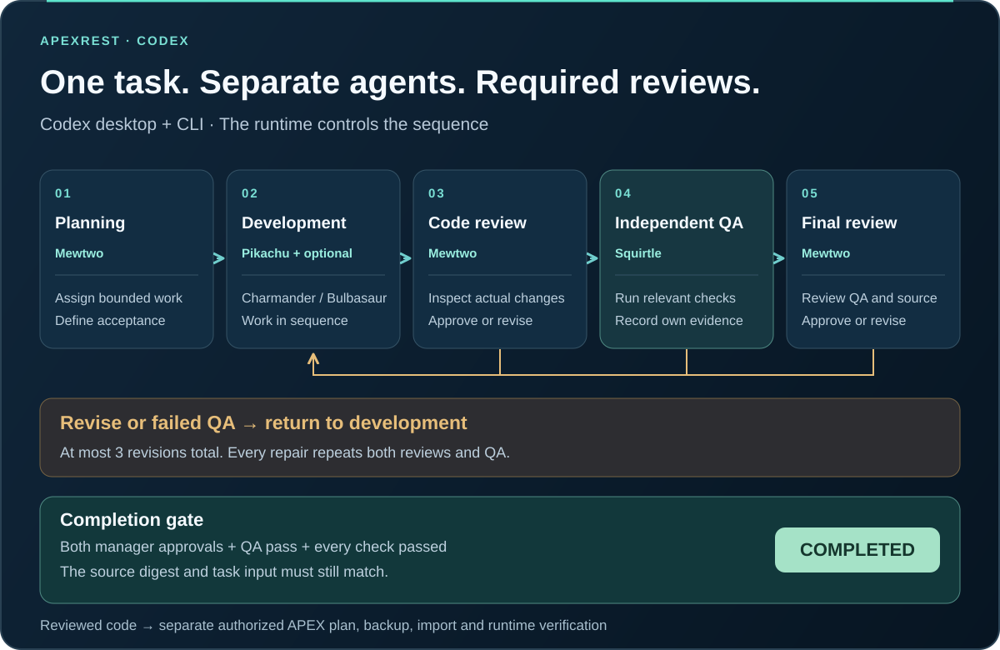

# Agent workflow: from task to reviewed result

English | [Українська](agent-workflow.uk.md)

Choose execution mode (`team` or `single`) and verification browser (`codex` or `external`) in project settings. See [mode settings](work-modes.md). Independent review/QA descriptions below apply to team mode; screenshots from September 17 show the earlier panel.

APEXREST runs an implementation through separate Codex sessions for a project manager, developers and independent QA. The runtime creates the roles and enforces the review order. The manager assigns work and reviews it; the developer cannot approve their own implementation, and a manager approval cannot turn failed QA into success.

This guide covers the complete user flow in **Codex desktop and Codex CLI**: opening the panel, starting a task, following the agents, changing a requirement, handling a failed check and moving an accepted change into the authorized APEX deployment workflow. The shorter [team API reference](team.md), [panel reference](panel.md) and [Codex source audit](codex-integration.md) describe the individual interfaces.



## 1. Open the application project

Install the plugin using [Getting started](getting-started.md), sign in to Codex and open the **application directory containing `apexrest.json`**. The project must be trusted before starting work. Use the application's directory when invoking tools; the plugin repository and its installed cache are different directories. An unconfigured folder can be inspected in the panel but cannot start an implementation.

For Oracle work, configure the reviewed Java/SQLcl toolchain, locally saved connections and explicit environment identities. The [configuration guide](configuration.md) covers workspace, parsing schema, application ID, source paths, toolchain locks and required test suites. Keep passwords out of tasks and screenshots.

For a new implementation, describe the change in Codex chat. The automatically discoverable `$apexrest-work` skill starts the team, opens its panel and brings the reviewed result back to this chat; no web form is required. See [Chat workflow and Auto models](chat-workflow.md).

To inspect a panel separately in Codex desktop, invoke `$apexrest-panel`. The skill opens the private local panel in the Codex in-app browser. `$apexrest-menu` describes the panel and lists **Reviewed development team** among its workflows. A direct `$apexrest-team` request starts the same reviewed implementation workflow without requiring the panel to be open.

In Codex CLI, open the live terminal view or read a scriptable snapshot:

```sh
apexrest panel tui --project /absolute/application
apexrest panel status --project /absolute/application --json
```

The panel TUI uses `1`–`4` or left/right to select a view, up/down or page keys to scroll, `r` to refresh and `q` to exit. It displays names and roles; Pokémon images appear in the desktop panel. The installation menu opened by plain `apexrest` is a separate TUI. Use explicit CLI/MCP operations to change settings or start work from the console.

## 2. Choose settings and describe the task

In **Settings**, inspect the effective project configuration and choose defaults for future teams. **New team task** opens a form with the task, developer count, developer permissions and time limit. State the expected behavior, files or pages in scope, acceptance checks and the identified environment if database work is intended. Starting the form launches a background team and returns its identifier; it is not a completed result.

| Setting | Behavior |
| --- | --- |
| Developers | One to three, selected before the team starts. They execute sequentially in the shared project. |
| Developer permissions | `workspace-write` by default, or `read-only` for analysis. Manager and QA stay read only. |
| Time limit | 900 seconds by default; allowed range 30–3600 for the whole team run. |
| Model and reasoning | Auto: fast/low for simple developer work, balanced/medium for ordinary work and QA, strong/high for complex implementation or repeated failures. The panel shows the selection reason; no manual selector. |
| Oracle backend | SQLcl CLI by default, or the official SQLcl MCP launched with `sql -mcp`. |
| MCP restriction level | Level 4 by default. Script-based writes through MCP require explicit level 1 and the existing deployment protections. |

SQLcl mode is saved in the managed APEXREST home and affects new operations across projects. Team defaults apply to future starts. Changing these fields does not alter a running team's roles or remove its review gates. Avoid changing transport during active database work. The Oracle MCP backend and the APEXREST MCP tools exposed to Codex are different layers.


*Actual Codex in-app browser capture, 17 September 2026. The default of one developer is for the next task; the completed example below was explicitly started with two. The lower form continues below the captured viewport.*

Equivalent CLI operations:

```sh
apexrest sqlcl status --json
apexrest sqlcl configure --mode cli --json
apexrest team start --project /absolute/application --task "Add a customer search page; verify empty results and input validation" --developers 2 --json
```

## 3. Meet the fixed team

| Identity | Stable role | Responsibility |
| --- | --- | --- |
| Mewtwo | `manager` | Plan, assign bounded work, review the actual code and review QA's evidence. |
| Pikachu | `developer-1` | Implement the first assigned part and report changes and checks. |
| Charmander | `developer-2` | Implement or inspect the second assigned part, when two or three developers are selected. |
| Bulbasaur | `developer-3` | Handle the third assigned part when three developers are selected. |
| Squirtle | `qa` | Independently inspect the result and execute relevant acceptance checks. |

Each role has a separate native Codex App Server thread and session identity. Roles share the project files and a scoped team context, not one conversation history. Developers take turns in the same directory; this does not create parallel worktrees. One team holds the project's team lock at a time. Recursive subagent creation is disabled for these role sessions.

The Pokémon names and bundled images are presentation identities. Stable role keys determine message routing, permissions and review authority. The ephemeral sessions do not support `thread/name/set`: these are names in the plugin roster and role instructions, not renamed tasks attached to the desktop conversation. Images load from the local bundle; [asset provenance](assets/README.md) records their source and copyright.


*Actual completed local coding fixture with two developers. Bulbasaur is absent because this run selected two. Tokens are cumulative values reported by Codex, including input context; they are not a price estimate. The capture shows completion, not a simulated live run.*

## 4. Follow the mandatory review cycle

| Stage | What happens | Condition for advancing |
| --- | --- | --- |
| Planning | Mewtwo defines assignments and acceptance checks. | A usable plan is recorded. |
| Development | Each selected developer works in order, seeing earlier changes and peer reports. | Developer turns finish; the controller records the source digest and task-input revision. |
| Code Review | Mewtwo inspects the actual source and reports a structured decision and findings. | `approve`, with unchanged source before QA. `revise` starts another development revision. |
| QA | Squirtle independently inspects and runs the relevant checks. | A valid report records `pass`, `fail` or `blocked`, with individual check evidence. |
| Final Review | Mewtwo reviews QA's result and the current implementation. | `approve`, QA `pass`, every QA check `passed`, and unchanged source and task input. |

The final manager review also runs after a valid failed or blocked QA report if the source is stable. It cannot override that failure. A report saying `pass` with a `failed` or `not_run` check does not satisfy the gate. Missing or malformed structured reports block completion.

Repairs return to development and repeat manager code review, QA and final manager review. There are at most **three development revisions**, including the initial one. Exhausting them produces `review_failed`, preserving findings for the next decision. The user does not have to remember to request a reviewer: the controller owns these transitions for tasks started through the team entry points.

The approval is bound to project file content and the input revision. The digest includes configuration and untracked files, excluding `.git`, `.apexrest`, `node_modules` and `.DS_Store`; symbolic links bind their link text, not external contents. A later source change makes the reported result `review_stale`. This is a local workflow safeguard, not a signature over external dependencies or an authorization to deploy.


*The recorded native fixture fixed finite-number addition. QA observed three required tests and 42 supplemental assertions passing; the verification harness separately repeated the three required tests. This establishes the local agent workflow, not Oracle compilation or import.*

## 5. Inspect progress and communicate

The panel refreshes every two seconds while visible and preserves focused form input. **Overview** combines the task, phase, review gate, Git changes and recent observed activity. **Agent team** adds each member's current tool, model, reasoning, sandbox, reported tokens, review findings, QA checks and peer-message delivery status. History is bounded to twelve recent runs; on-screen reports are concise summaries.

Agents use scoped `team_context` and `team_message` tools to exchange plans, source findings and evidence. A message is queued for the recipient's next scheduled turn, or delivered through native steering if that recipient is active. Queued does not mean read. A recipient with no further turn can leave a message `not_delivered`; uncertain delivery remains visible. These tools cannot address unrelated tasks or create another team.

Use **Send a task update** to clarify an active task. It routes the new information to the manager and invalidates completion based on older input. Use **Stop team** to request interruption. A completed team cannot receive a new task update; start a new reviewed task with the additional requirement.

```sh
apexrest team status TEAM_ID --project /absolute/application --json
apexrest team message TEAM_ID "Also verify the empty-results state" --project /absolute/application --json
apexrest team cancel TEAM_ID --project /absolute/application --json
```

Status output includes `fullReport`, pointing to the private `.apexrest/teams/<id>/state.json`. It retains more detail than the bounded status response, including reports and bounded native observations. Inspect the Git diff and actual test artifacts alongside agent summaries. An observed command event is evidence that it ran; an agent's narrative alone is not independent proof that every claim is correct.

## 6. Handle incomplete or uncertain work

| State | Meaning and next step |
| --- | --- |
| `queued` / `running` | Work is scheduled or active. Follow the current phase, tool activity and messages. |
| `completed` | All required review gates passed for the recorded source and task input. Inspect the result before subsequent delivery. |
| `review_failed` | The revision limit was reached without all gates passing. Read the findings and decide the next scoped task. |
| `review_stale` | Source changed after approval. Run a new reviewed task against the changed source. |
| `blocked` | A prerequisite, permission, interactive input or valid report is missing. Resolve the stated cause and inspect existing changes before starting again. |
| `cancelling` / `cancelled` | Interruption is requested or recorded. Existing file and database changes are not rolled back. |
| `outcome_unknown` | Completion cannot be established, for example after disconnect, timeout or a stale heartbeat. Reconcile source, reports and operation journals before retrying. |

A worker heartbeat older than 60 seconds is reported as unknown; it is not a reason to automatically replay the task. Background sessions cannot answer a new interactive approval prompt. Manager and QA have read-only file sandboxes and read-only APEXREST tool access; tests that require unavailable writes, authentication or permissions can remain blocked. Other configured tools are still subject to Codex policy, and file sandboxing is not a universal remote-service permission boundary.

The runtime enforces this cycle within APEXREST team execution. It does not intercept arbitrary commands issued outside that workflow, attach roles to the current desktop task's private agent registry or prevent a person from editing the shared project.

## 7. Move from reviewed code to an APEX import

**APEX operations** can queue source compilation, configured tests or a deployment plan for an explicitly selected environment. It shows real background jobs, their nested outcome, diagnostic/artifact references and the durable deployment/import journal. **Settings** exposes the effective environment identities, connection references, toolchain, required suites, browser and artifact settings, and grant metadata; secret stores are not read for display.


*This fixture has no Oracle environment or import history. Its panel test job returned `not_configured` because the project has no configured unit suite. This is distinct from the developer's three fixture tests run directly by QA, and is not presented as a passed APEXREST suite.*

For an identified, authorized development/test application change, continue with [deployment safety](deployment-safety.md):

1. Validate the source and inspect the real target identity. Preserve the project's established required-suite scope.
2. Create a deployment plan binding source, configuration, toolchain and the expected target state.
3. Record existing user authorization as the exact, short-lived project/target/plan grant when required. Team approval does not supply that authorization.
4. Apply through the deployment workflow, preserving backup, coordination, drift checks and first-error handling. A clean supported APEX target uses local durable control by default; service tables are optional.
5. Verify runtime identity and the relevant tests. For user-visible changes, observe the affected pages and behavior in the Codex in-app browser and record those observations separately from automated results.

The panel has no direct **Apply**, **Approve review** or **Grant trust** button. Production requires its protected external approval. If an import is interrupted after writing may have begun, reconcile the deployment journal before retrying; cancellation and a team failure do not undo Oracle changes. See [clean APEX deployment](clean-apex-deployment.md) and [testing](testing.md) for the supported scope.

## 8. Integration, evidence and current limits

| Layer | Interface and responsibility |
| --- | --- |
| Codex entry | Native plugin skills, APEXREST MCP tools and the CLI share one runtime. |
| Team control | `team.start/status/message/cancel` create and supervise the required roles and review state. |
| Native execution | Codex App Server `thread/start`, `turn/start`, `turn/steer`, `turn/interrupt` and native item/turn events. |
| Peer context | Scoped dynamic `team_context` / `team_message`, backed by the team's local state. |
| Panel | `panel.open/status/action`; a loopback web view in the Codex in-app browser and a CLI TUI use the same snapshot. |
| Oracle operations | Shared policy, jobs and deployment services use SQLcl CLI or Oracle's official SQLcl MCP backend. |

The panel's local server validates Host/Origin, serves a fixed asset allowlist and requires a private session capability for data and actions. It closes after one hour without authorized requests. Keep the local capability URL and session file private; opening a panel does not grant deployment authority.

The open-source Codex audit found an internal agent registry, but no public plugin RPC for that private registry. APEXREST uses supported App Server session orchestration. The verified desktop surface is the **in-app browser**, not a custom persistent sidebar or status-line extension. An MCP UI resource is advertised and contract-checked; embedded rendering in the desktop host remains unverified.

| Evidence | Established scope |
| --- | --- |
| [Native team run](evidence/panel-team-native.json) | Real Codex inference, four separate roles, peer communication, both manager approvals, independent QA and a separate harness test run on an isolated local coding fixture. |
| [QA gate run](evidence/panel-team-qa-gate.json) | A separate real run with blocked QA remained unsuccessful despite manager approval. Its historical outcome is preserved. |
| [Native plugin discovery](evidence/panel-native-discovery.json) | Isolated installation of the built bundle, skills/tools discovery and exact MCP calls. |
| [Panel checks](evidence/panel-local-checks.json) | Local contracts/security, actual desktop-browser observations and console PTY checks, with their source scope. |
| [Screenshot record](evidence/agent-workflow-documentation.json) | Capture context and hashes of these actual browser images; no capability URL or credentials. |

These screenshots were captured from the installed panel on 17 September 2026. They are unretouched viewport captures of actual UI state; scrolling selects the relevant section. They do not establish an Oracle deployment, Windows behavior, private desktop-agent attachment or embedded MCP UI rendering. Later runtime changes need fresh checks; [implementation status](implementation-status.md) and [next actions](next-actions.md) retain the distinction between implemented behavior, verification and open work.
