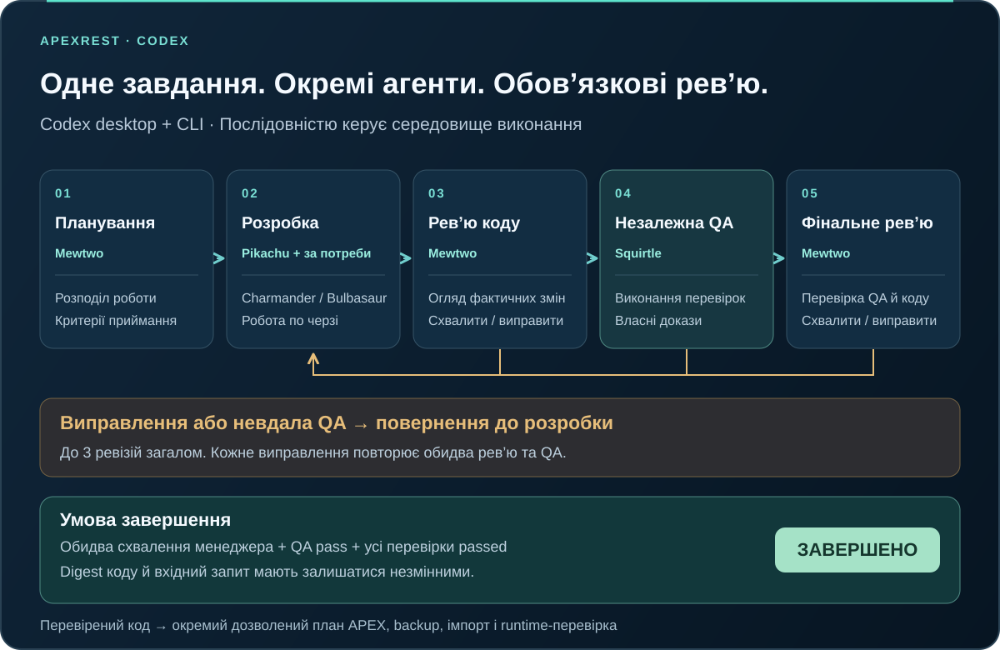
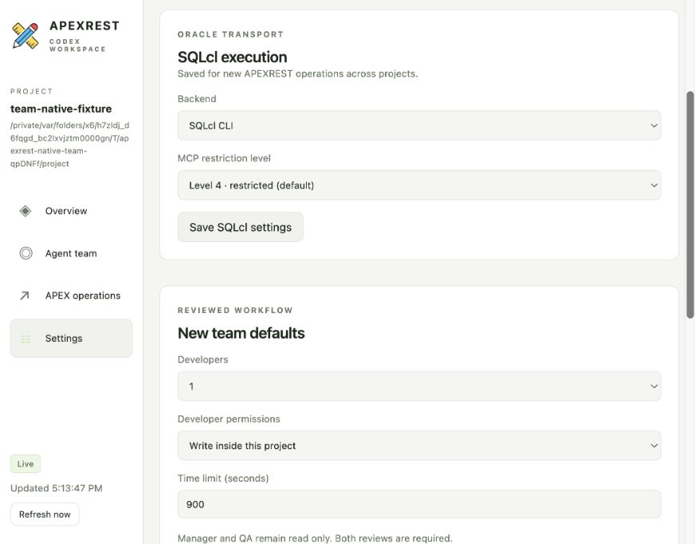
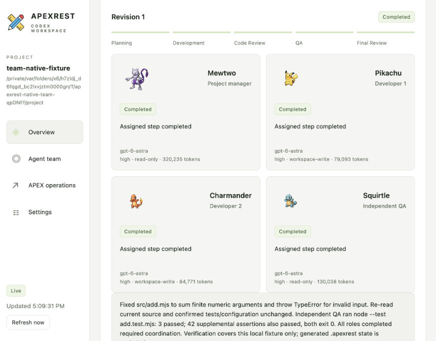
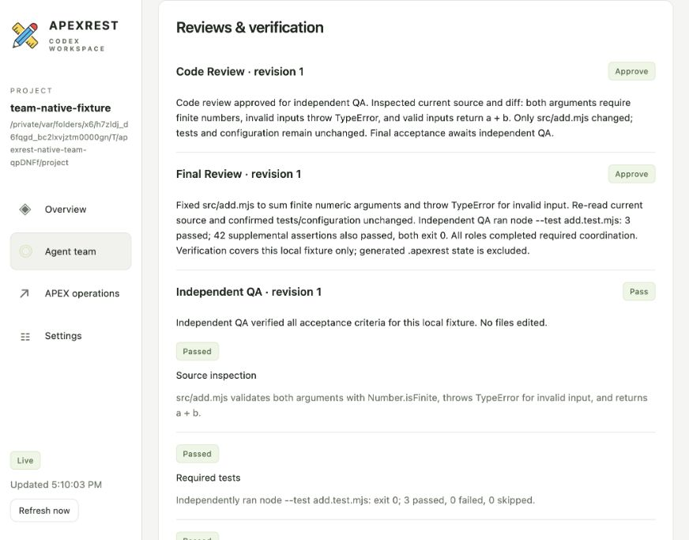
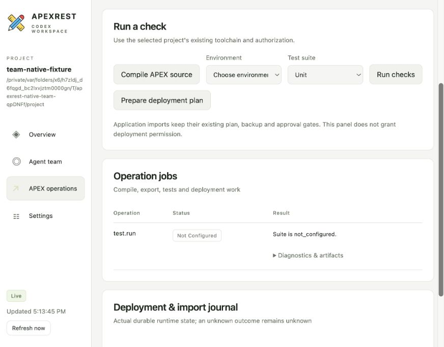

# Агентний процес: від завдання до перевіреного результату

[English](agent-workflow.md) | Українська

APEXREST виконує реалізацію в окремих сесіях Codex для менеджера проєкту, розробників і незалежного QA. Середовище виконання створює ролі й примусово дотримується порядку рев’ю. Менеджер розподіляє роботу та перевіряє її; розробник не може схвалити власну реалізацію, а схвалення менеджера не перетворює невдалу QA на успіх.

Цей посібник описує повний шлях користувача в **Codex desktop і Codex CLI**: відкриття панелі, запуск завдання, спостереження за агентами, уточнення вимоги, роботу з невдалою перевіркою та передачу прийнятої зміни до дозволеного розгортання APEX. Стислі [довідка API команди](team.uk.md), [довідка панелі](panel.uk.md) та [аудит коду Codex](codex-integration.uk.md) пояснюють окремі інтерфейси.



## 1. Відкрийте проєкт застосунку

Встановіть плагін за [інструкцією початку роботи](getting-started.uk.md), увійдіть у Codex і відкрийте **каталог застосунку з `apexrest.json`**. Перед запуском роботи проєкт має бути довіреним. Передавайте інструментам каталог застосунку; репозиторій плагіна та його встановлений кеш — інші каталоги. Неналаштовану папку можна переглядати в панелі, але не можна запускати в ній реалізацію.

Для роботи з Oracle налаштуйте перевірені Java/SQLcl, локально збережені з’єднання та явні ідентичності середовищ. [Посібник із конфігурації](configuration.uk.md) описує workspace, parsing schema, ID застосунку, шляхи коду, зафіксовані версії інструментів та обов’язкові тестові набори. Не додавайте паролі до завдань і скріншотів.

Для нової реалізації опишіть зміну в чаті Codex. Автоматично доступний скіл `$apexrest-work` запускає команду, відкриває її панель і повертає перевірений результат у цей чат; вебформу заповнювати не потрібно. Див. [Сценарій із чату й моделі Auto](chat-workflow.uk.md).

Щоб окремо оглянути панель у Codex desktop, викличте `$apexrest-panel`. Навичка відкриває приватну локальну панель у вбудованому браузері Codex. `$apexrest-menu` також пояснює панель і містить **Reviewed development team** серед доступних процесів. Прямий запит `$apexrest-team` запускає той самий процес реалізації з рев’ю без потреби тримати панель відкритою.

У Codex CLI відкрийте живий термінальний вигляд або отримайте знімок для скрипта:

```sh
apexrest panel tui --project /absolute/application
apexrest panel status --project /absolute/application --json
```

У TUI панелі `1`–`4` або стрілки ліворуч/праворуч вибирають розділ, вгору/вниз чи клавіші сторінок прокручують, `r` оновлює, `q` завершує. Він показує імена й ролі; зображення покемонів є в desktop-панелі. Меню встановлення, яке відкриває звичайна команда `apexrest`, — окремий TUI. Для зміни налаштувань і запуску роботи з консолі використовуйте явні CLI/MCP-операції.

## 2. Виберіть налаштування й опишіть завдання

У **Settings** перегляньте фактичну конфігурацію проєкту й виберіть типові параметри майбутніх команд. **New team task** відкриває форму із завданням, кількістю розробників, їхніми дозволами та лімітом часу. Вкажіть очікувану поведінку, файли чи сторінки в межах роботи, критерії приймання та конкретне середовище, якщо передбачено роботу з БД. Запуск із форми створює фонову команду й повертає її ідентифікатор; це ще не готовий результат.

| Налаштування | Поведінка |
| --- | --- |
| Developers | Від одного до трьох, вибираються до старту. Працюють послідовно у спільному проєкті. |
| Developer permissions | Типово `workspace-write`, або `read-only` для аналізу. Менеджер і QA залишаються лише для читання. |
| Time limit | Типово 900 секунд; дозволено 30–3600 для всього запуску команди. |
| Модель і рівень міркування | Auto: fast/low для простих правок розробника, balanced/medium для звичайної роботи й QA, strong/high для складної реалізації або повторних невдач. Панель показує причину вибору; ручного перемикача немає. |
| Oracle backend | Типово SQLcl CLI, або офіційний SQLcl MCP, запущений через `sql -mcp`. |
| MCP restriction level | Типово рівень 4. Записи через MCP зі скриптами потребують явного рівня 1 і чинних захистів розгортання. |

Режим SQLcl зберігається в керованому каталозі APEXREST і впливає на нові операції в різних проєктах. Типові параметри команди застосовуються до майбутніх запусків. Зміна цих полів не змінює ролей уже запущеної команди й не прибирає вимог рев’ю. Не перемикайте транспорт під час активної роботи з БД. Oracle MCP і MCP-інструменти APEXREST, доступні Codex, — різні рівні системи.



*Справжній знімок вбудованого браузера Codex від 17 вересня 2026 року. Типове значення «один розробник» стосується наступного завдання; завершений приклад нижче явно запускався з двома. Нижня форма продовжується за межами кадру.*

Еквівалентні CLI-операції:

```sh
apexrest sqlcl status --json
apexrest sqlcl configure --mode cli --json
apexrest team start --project /absolute/application --task "Add a customer search page; verify empty results and input validation" --developers 2 --json
```

## 3. Познайомтеся з фіксованою командою

| Ім’я | Стабільна роль | Відповідальність |
| --- | --- | --- |
| Mewtwo | `manager` | План, обмежені доручення, перевірка фактичного коду й доказів QA. |
| Pikachu | `developer-1` | Реалізація першої частини та звіт про зміни й перевірки. |
| Charmander | `developer-2` | Реалізація або огляд другої частини, коли вибрано двох чи трьох розробників. |
| Bulbasaur | `developer-3` | Третя частина роботи, коли вибрано трьох розробників. |
| Squirtle | `qa` | Незалежний огляд результату та виконання відповідних перевірок приймання. |

Кожна роль має окремі нативні thread і session у Codex App Server. Ролі спільно використовують файли проєкту й обмежений контекст команди, а не одну історію розмови. Розробники працюють по черзі в одному каталозі; паралельні worktree не створюються. Блокування команди в проєкті одночасно утримує лише одна команда. Рекурсивне створення субагентів у цих рольових сесіях вимкнено.

Імена покемонів і комплектні зображення — позначення для відображення. Стабільні ключі ролей визначають маршрутизацію повідомлень, дозволи й повноваження рев’ю. Тимчасові сесії не підтримують `thread/name/set`: це імена в реєстрі плагіна та рольових інструкціях, а не перейменовані задачі, приєднані до desktop-розмови. Зображення завантажуються з локального пакета; [походження ресурсів](assets/README.uk.md) фіксує джерело й авторські права.



*Фактично завершене локальне тестове завдання з двома розробниками. Bulbasaur відсутній, бо запуск вибрав двох. Токени — сумарні значення Codex, включно з вхідним контекстом; це не оцінка вартості. Кадр показує завершення, а не імітований живий запуск.*

## 4. Стежте за обов’язковим циклом рев’ю

| Етап | Що відбувається | Умова переходу |
| --- | --- | --- |
| Planning | Mewtwo визначає доручення та критерії приймання. | Зафіксовано придатний план. |
| Development | Кожен вибраний розробник працює по черзі, бачить попередні зміни й звіти колег. | Ходи розробників завершено; контролер записує digest коду та ревізію вхідного завдання. |
| Code Review | Mewtwo перевіряє фактичний код і надає структуроване рішення із зауваженнями. | `approve` і незмінний код перед QA. `revise` запускає наступну ревізію розробки. |
| QA | Squirtle самостійно перевіряє й виконує відповідні тести. | Коректний звіт фіксує `pass`, `fail` або `blocked` із доказами окремих перевірок. |
| Final Review | Mewtwo перевіряє результат QA та поточну реалізацію. | `approve`, QA `pass`, кожна QA-перевірка `passed`, код і вхідне завдання не змінилися. |

Фінальне рев’ю менеджера відбувається й після коректного звіту про невдалу або заблоковану QA, якщо код стабільний. Воно не може скасувати цю невдачу. Звіт `pass` із перевіркою `failed` чи `not_run` не виконує умову приймання. Відсутній або некоректний структурований звіт блокує завершення.

Виправлення повертають роботу до розробки й повторюють рев’ю коду менеджером, QA та фінальне рев’ю. Дозволено щонайбільше **три ревізії розробки**, включно з початковою. Якщо умови не виконано, результат — `review_failed`, а зауваження зберігаються для наступного рішення. Користувачеві не потрібно окремо просити рев’ювера: переходами керує контролер для завдань, запущених через командні точки входу.

Схвалення прив’язане до вмісту файлів проєкту й ревізії запиту. Digest включає конфігурацію та untracked-файли, виключаючи `.git`, `.apexrest`, `node_modules` і `.DS_Store`; символічні посилання враховують текст посилання, а не зовнішній вміст. Подальша зміна коду робить результат `review_stale`. Це локальний захист процесу, а не підпис зовнішніх залежностей чи дозвіл на деплой.



*Записане нативне тестове завдання виправило додавання скінченних чисел. QA спостерігав успішне виконання трьох обов’язкових тестів і 42 додаткових assertions; окремий перевірочний сценарій повторив три обов’язкові тести. Це підтверджує локальний агентний процес, а не компіляцію чи імпорт Oracle.*

## 5. Переглядайте прогрес і спілкуйтеся

Панель оновлюється кожні дві секунди, коли видима, і зберігає введення у сфокусованій формі. **Overview** поєднує завдання, етап, стан рев’ю, зміни Git та недавню спостережувану активність. **Agent team** додає поточний інструмент кожного учасника, модель, рівень міркування, sandbox, токени, зауваження рев’ю, перевірки QA та статус доставки повідомлень. Історію обмежено дванадцятьма останніми запусками; звіти на екрані скорочено.

Агенти використовують обмежені `team_context` і `team_message`, щоб обмінюватися планами, висновками про код і доказами. Повідомлення чекає наступного запланованого ходу адресата або передається нативним steering, якщо той активний. «У черзі» не означає «прочитано». Якщо адресат більше не матиме ходу, повідомлення може залишитися `not_delivered`; невизначена доставка також видима. Ці інструменти не можуть звертатися до сторонніх задач або створювати іншу команду.

Через **Send a task update** уточнюйте активне завдання. Нові дані передаються менеджеру й скасовують можливість завершення на основі попереднього запиту. **Stop team** запитує переривання. Завершена команда не приймає нових уточнень; запустіть нове завдання з рев’ю для додаткової вимоги.

```sh
apexrest team status TEAM_ID --project /absolute/application --json
apexrest team message TEAM_ID "Also verify the empty-results state" --project /absolute/application --json
apexrest team cancel TEAM_ID --project /absolute/application --json
```

Відповідь стану містить `fullReport` із посиланням на приватний `.apexrest/teams/<id>/state.json`. Він містить більше деталей, ніж скорочена відповідь стану: звіти й обмежені нативні спостереження. Переглядайте Git diff і фактичні тестові артефакти разом зі звітами агентів. Подія команди підтверджує її виконання; сама розповідь агента не є незалежним доказом правильності всіх тверджень.

## 6. Обробляйте незавершену або невизначену роботу

| Стан | Значення й наступний крок |
| --- | --- |
| `queued` / `running` | Роботу заплановано або вона виконується. Стежте за етапом, інструментами й повідомленнями. |
| `completed` | Усі обов’язкові рев’ю пройдено для записаного коду й запиту. Перегляньте результат перед подальшою доставкою. |
| `review_failed` | Ліміт ревізій вичерпано без виконання всіх умов. Прочитайте зауваження та визначте наступне завдання в конкретних межах. |
| `review_stale` | Після схвалення змінився код. Запустіть нове завдання з рев’ю для змінених джерел. |
| `blocked` | Бракує передумови, дозволу, інтерактивної відповіді або коректного звіту. Усуньте зазначену причину й перевірте вже внесені зміни перед новим запуском. |
| `cancelling` / `cancelled` | Переривання запитано або зафіксовано. Наявні зміни файлів і БД не відкочуються. |
| `outcome_unknown` | Завершення неможливо встановити, наприклад після розриву зв’язку, таймауту чи застарілого heartbeat. Звірте код, звіти й журнали операцій перед повтором. |

Heartbeat worker старший за 60 секунд означає невідомий результат; це не підстава автоматично повторювати завдання. Фонові сесії не можуть відповісти на новий інтерактивний запит схвалення. Менеджер і QA мають файлові sandbox лише для читання й доступ лише до читання в інструментах APEXREST; перевірки, що потребують недоступного запису, автентифікації чи дозволів, можуть залишитися заблокованими. Інші налаштовані інструменти підпорядковані політиці Codex; файловий sandbox не є універсальною межею дозволів для віддалених сервісів.

Середовище виконання примусово забезпечує цей цикл у командному процесі APEXREST. Воно не перехоплює довільні команди поза цим процесом, не приєднує ролі до приватного реєстру агентів поточної desktop-задачі й не забороняє людині редагувати спільний проєкт.

## 7. Перейдіть від перевіреного коду до імпорту APEX

**APEX operations** запускає компіляцію коду, налаштовані тести або план розгортання для явно вибраного середовища. Розділ показує справжні фонові операції, їхній вкладений результат, посилання на діагностику/артефакти та стійкий журнал деплою/імпорту. **Settings** відкриває фактичні ідентичності середовищ, посилання на з’єднання, інструменти, обов’язкові набори, браузерні й артефактні налаштування та метадані дозволів; сховища секретів для відображення не читаються.



*Цей тестовий проєкт не має середовища Oracle чи історії імпорту. Тестова операція панелі повернула `not_configured`, бо в проєкті не налаштовано unit-набору. Це окремо від трьох тестів прикладу, які QA запускав напряму, і не подається як успішний набір APEXREST.*

Для визначеної та дозволеної зміни development/test-застосунку продовжуйте за [правилами безпеки розгортання](deployment-safety.uk.md):

1. Валідуйте код і перевірте справжню ідентичність цілі. Збережіть усталений обсяг обов’язкових тестових наборів проєкту.
2. Створіть план розгортання, прив’язаний до коду, конфігурації, інструментів та очікуваного стану цілі.
3. За потреби запишіть наявний дозвіл користувача як точний короткочасний grant для проєкту/цілі/плану. Схвалення команди не надає такого дозволу.
4. Застосуйте план через процес розгортання зі збереженням резервної копії, координації, перевірок дрейфу та зупинки на першій помилці. Чиста підтримувана APEX-інсталяція типово використовує локальний стійкий контроль; службові таблиці необов’язкові.
5. Перевірте runtime-ідентичність і відповідні тести. Для видимих користувачу змін перегляньте сторінки та поведінку у вбудованому браузері Codex і запишіть спостереження окремо від автоматичних результатів.

Панель не має прямих кнопок **Apply**, **Approve review** чи **Grant trust**. Production потребує захищеного зовнішнього схвалення. Якщо імпорт перервано після можливого початку запису, звірте журнал розгортання перед повтором; скасування та невдача команди не відкочують зміни Oracle. Межі підтримки описано в [чистому розгортанні APEX](clean-apex-deployment.uk.md) та [тестуванні](testing.uk.md).

## 8. Інтеграція, докази та поточні обмеження

| Рівень | Інтерфейс і відповідальність |
| --- | --- |
| Вхід Codex | Нативні навички плагіна, MCP-інструменти APEXREST і CLI використовують спільне середовище виконання. |
| Керування командою | `team.start/status/message/cancel` створюють і контролюють обов’язкові ролі та стан рев’ю. |
| Нативне виконання | Codex App Server `thread/start`, `turn/start`, `turn/steer`, `turn/interrupt` та нативні події item/turn. |
| Контекст колег | Обмежені динамічні `team_context` / `team_message` на основі локального стану команди. |
| Панель | `panel.open/status/action`; локальний web-вигляд у браузері Codex та CLI TUI використовують єдиний знімок стану. |
| Операції Oracle | Спільні політики, jobs і сервіси розгортання використовують SQLcl CLI або офіційний SQLcl MCP Oracle. |

Локальний сервер панелі перевіряє Host/Origin, віддає фіксований перелік ресурсів і вимагає приватний ключ сесії для даних та дій. Він закривається через годину без авторизованих запитів. Не публікуйте локальну URL-адресу з ключем доступу та файл сесії; відкриття панелі не надає дозволу на розгортання.

Аудит відкритого коду Codex виявив внутрішній реєстр агентів, але не публічний RPC плагіна для цього приватного реєстру. APEXREST використовує підтримувану оркестрацію сесій App Server. Перевірена desktop-поверхня — **вбудований браузер**, а не власна постійна бічна панель чи розширення рядка стану. MCP UI ресурс оголошено й перевірено на рівні контракту; його вбудоване відображення desktop-хостом ще не підтверджено.

| Докази | Підтверджений обсяг |
| --- | --- |
| [Нативна команда](evidence/panel-team-native.json) | Справжній inference Codex, чотири окремі ролі, повідомлення, обидва схвалення менеджера, незалежна QA й окремий повтор тестів на ізольованому локальному завданні. |
| [Умова QA](evidence/panel-team-qa-gate.json) | Окремий реальний запуск із заблокованою QA залишився неуспішним попри схвалення менеджера. Історичний результат збережено. |
| [Нативне виявлення плагіна](evidence/panel-native-discovery.json) | Ізольоване встановлення зібраного пакета, виявлення навичок/інструментів і точні MCP-виклики. |
| [Перевірки панелі](evidence/panel-local-checks.json) | Локальні контракти/безпека, фактичні спостереження в desktop-браузері та консольні PTY-перевірки з прив’язкою до джерел. |
| [Запис скріншотів](evidence/agent-workflow-documentation.json) | Контекст і хеші справжніх браузерних знімків; без URL із ключем доступу чи облікових даних. |

Ці скріншоти знято зі встановленої панелі 17 вересня 2026 року. Це неретушовані кадри видимої області зі справжнім станом UI; прокручування вибирає потрібний розділ. Вони не підтверджують деплой Oracle, поведінку Windows, приєднання до приватних desktop-агентів чи вбудоване MCP UI. Подальші зміни середовища виконання потребують нових перевірок; [стан реалізації](implementation-status.uk.md) та [наступні дії](next-actions.uk.md) розділяють реалізовану поведінку, верифікацію та відкриту роботу.
