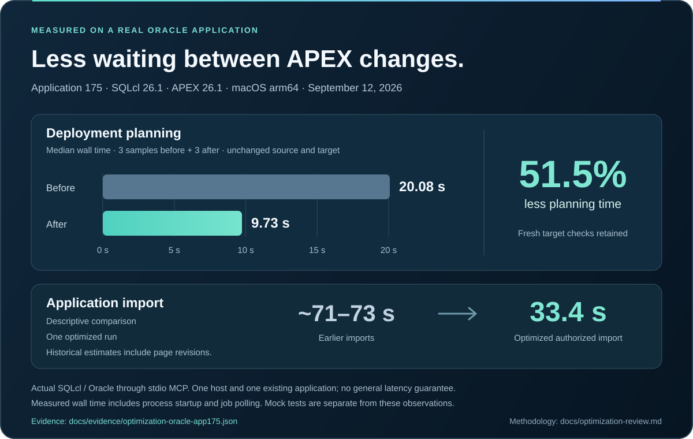

# Build Oracle APEX applications in Codex

APEXREST brings application source, Oracle compilation, controlled imports and runtime verification into one native Codex plugin.

**Open source · Apache-2.0 · Beta {{version}}**

[Install in Codex](install/) · [Get started](../../docs/getting-started.md) · [Explore the source](https://github.com/apexrest-dev/apexrest-codex)

## Create, change and verify

| Your task              | The plugin workflow                                                                                               |
| ---------------------- | ----------------------------------------------------------------------------------------------------------------- |
| Start an application   | Generate a blank application or CRM from native APEXlang templates.                                               |
| Change an existing app | Export its current source, make a focused edit and validate with the Oracle compiler.                             |
| Import the change      | Review source and target details, preserve a backup and apply within the authorized scope.                        |
| Check the result       | Run the relevant source and test checks, then verify visible behavior in the Codex in-app browser when available. |

## Faster iteration with the same deployment checks

A real application trial drove fewer SQLcl startups and parallel read-only preflight work. The measured plan time fell from 20.08 to 9.73 seconds. A representative import completed in 33.4 seconds, compared with approximately 71–73 seconds in earlier runs. These are observed trial results, not a latency guarantee.

Read the [measurement scope](../../docs/optimization-review.md) and [deployment safeguards](../../docs/deployment-safety.md).

## Evidence you can inspect

The Codex compatibility profile and a real APEX application import have been exercised on macOS arm64. Automated local tests, Oracle observations and browser checks are recorded separately. Stable release qualification still requires the remaining platform and integration evidence.

Use the [support matrix](versions/), [implementation status](../../docs/implementation-status.md) and [release process](releases/) to assess your environment. APEXREST is independent tooling, not an official Oracle or OpenAI product.
