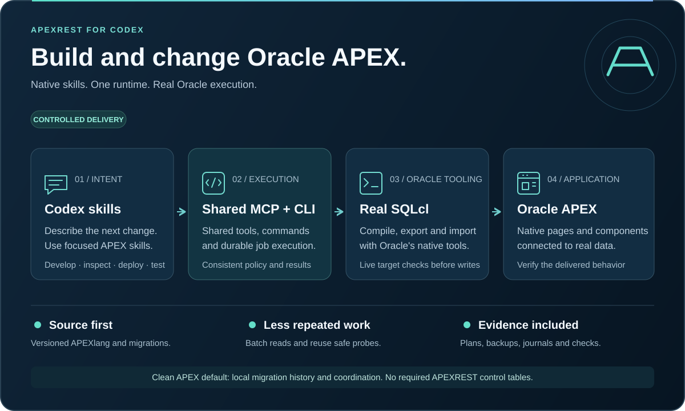

# Build Oracle APEX applications in Codex

English | [Українська](index.uk.md)

APEXREST brings application source, Oracle compilation, controlled imports and runtime verification into one native Codex plugin.

**Open source · Apache-2.0 · Version {{version}}**

[Install in Codex](install.md) · [Get started](../../docs/getting-started.md) · [Explore the source](https://github.com/apexrest-dev/apexrest-codex)

Install the CLI with `npm install -g apexrest`, then run `apexrest` to install tools and register the Codex plugin. Release 1.0.0 runs directly in your current Codex conversation; [release notes](../../docs/release-notes.md) track distribution and evidence.

## Create, change and verify

| Your task              | The plugin workflow                                                                                               |
| ---------------------- | ----------------------------------------------------------------------------------------------------------------- |
| Start an application   | Generate a blank application or CRM from native APEXlang templates.                                               |
| Change an existing app | Export its current source, make a focused edit and validate with the Oracle compiler.                             |
| Import the change      | Review source and target details, preserve a backup and apply within the authorized scope.                        |
| Check the result       | Run the relevant source and test checks, then verify visible behavior in the Codex in-app browser when available. |

## Efficient iteration with deployment checks

The workflow reuses project discovery, batches related edits and runs independent read-only preflight work concurrently. Planning includes compiler validation. Fresh target checks, source and target drift checks, authorization, coordination and existing-app backups remain part of deployment.

Read the [runtime optimization review](../../docs/optimization-review.md) and [deployment safeguards](../../docs/deployment-safety.md).

## Evidence you can inspect

The Codex compatibility profile and real Oracle template compilation have been exercised on macOS arm64. Automated local tests, compiler results and native-host checks are recorded separately. Stable release qualification still requires the remaining platform and connected integration evidence.

Use the [support matrix](versions.md), [implementation status](../../docs/implementation-status.md) and [release process](releases.md) to assess your environment. APEXREST is independent tooling, not an official Oracle or OpenAI product.
